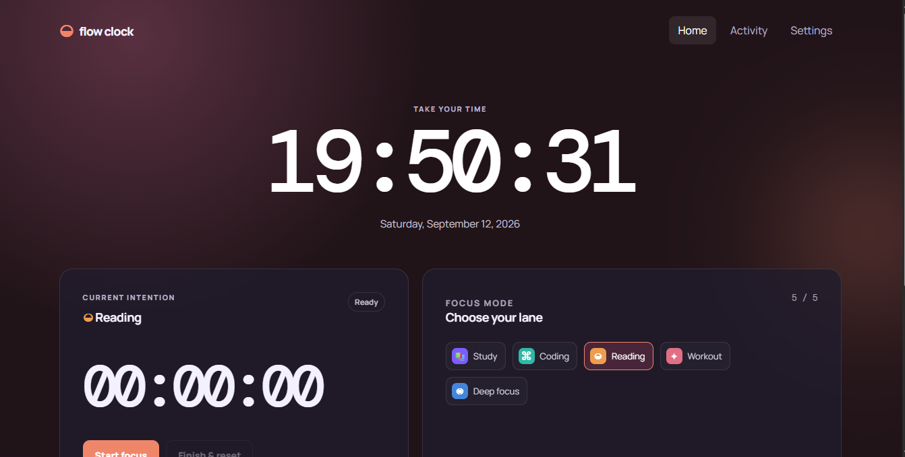

# Flow Clock — Calm Productivity for Focused Work



> **Flow Clock** — A powerful, privacy-first productivity tool that makes focused work feel rewarding. Track sessions, build streaks, visualize your activity, and unlock themes as you maintain consistent daily habits.

## Table of Contents

- [Overview](#overview)
- [Features](#features)
- [Getting Started](#getting-started)
- [Installation](#installation)
- [Usage Guide](#usage-guide)
- [Project Architecture](#project-architecture)
- [Technology Stack](#technology-stack)
- [Data Model & Storage](#data-model--storage)
- [Component Documentation](#component-documentation)
- [Hooks & Custom Logic](#hooks--custom-logic)
- [Utilities & Services](#utilities--services)
- [State Management](#state-management)
- [Theming System](#theming-system)
- [Streaks & Statistics](#streaks--statistics)
- [Pricing & Premium Features](#pricing--premium-features)
- [Browser Compatibility](#browser-compatibility)
- [Privacy & Data Protection](#privacy--data-protection)
- [Development Guide](#development-guide)
- [Build & Deployment](#build--deployment)
- [Troubleshooting](#troubleshooting)
- [Future Roadmap](#future-roadmap)
- [Contributing](#contributing)
- [License](#license)

---

## Overview

**Flow Clock V1.5** is an enhanced productivity application designed to help students, programmers, readers, and self-learners maintain consistent focus habits through gamified session tracking, streak motivation, and beautiful progress visualization.

The application solves a critical problem: **Users lose motivation when simply tracking time isn't enough**. Flow Clock makes progress visible and rewarding through:

- Real-time session tracking with pause/resume capabilities
- Daily streak maintenance and visualization
- Comprehensive activity statistics
- Theme unlocking through consistent work
- Responsive, beautiful user interface
- Complete local data ownership

**Core Principle**: Focus Clock believes that *focus should feel calm, rewarding, and motivating* — without requiring account creation, backend infrastructure, or cloud dependencies.

---

## Features

### 1. **Focus Sessions & Stopwatch**
- ✅ Start, pause, resume, and complete work sessions
- ✅ Multiple focus modes (Study, Coding, Reading, Workout, Custom)
- ✅ Real-time duration tracking with HH:MM:SS format
- ✅ Meaningful session threshold (configurable, default: 5 minutes)
- ✅ Session validation and integrity checking
- ✅ Works seamlessly with browser refresh (state persisted)

### 2. **Streak Tracking & Motivation**
- ✅ Current streak tracking with daily consistency checks
- ✅ Longest streak calculation across all time
- ✅ Total active days counter
- ✅ Daily activity verification (meaningful sessions only)
- ✅ Streak unlock rewards (themes at 7 and 30-day milestones)
- ✅ Visual streak display with fire emoji indicator

### 3. **Session History & Activity Log**
- ✅ Complete session history (up to 500 sessions stored)
- ✅ Sessions grouped by date (newest first)
- ✅ Displays: Mode, Duration, Date, Time for each session
- ✅ Session completion timestamps and mode selection
- ✅ Data migration from V1 format automatically handled
- ✅ Quick access to recent sessions (last 20 visible)

### 4. **Statistics Dashboard**
- ✅ **Today**: Time focused today
- ✅ **This Week**: Total focus for current week (Monday-Sunday)
- ✅ **This Month**: Total focus for current month
- ✅ **All-Time Total**: Cumulative focused time across all sessions
- ✅ **Session Count**: Total number of meaningful sessions
- ✅ **Average Session**: Mean duration of completed sessions
- ✅ **Active Days**: Number of days with meaningful work
- ✅ **Most Used Mode**: Most frequently used activity mode
- ✅ **Focus by Mode**: Breakdown of time spent in each mode

### 5. **Activity Grid Visualization**
- ✅ GitHub-style contribution grid (365-day view)
- ✅ Color intensity based on daily focus duration
- ✅ 4 intensity levels (no activity → high activity)
- ✅ Hover tooltips showing date and session details
- ✅ Keyboard accessible with ARIA labels
- ✅ Shows session count and duration per day

### 6. **Theme System & Customization**
- ✅ 5 built-in themes (Midnight, Ocean, Sunset, Light, Minimal)
- ✅ Theme unlocking through streak milestones
- ✅ Custom theme uploads (Premium feature)
- ✅ Support for custom background images (1.5 MB limit)
- ✅ CSS variable-based theming system
- ✅ Persistent theme preferences

### 7. **Custom Focus Modes**
- ✅ 5 default modes provided out-of-the-box
- ✅ Create unlimited custom modes (Free: up to 5, Premium: unlimited)
- ✅ Mode customization (name, icon, accent color)
- ✅ Delete custom modes (cannot delete default modes)
- ✅ Mode selection persistence
- ✅ Mode-based activity tracking

### 8. **Local-First Architecture**
- ✅ All data stored in browser localStorage
- ✅ No cloud sync, no account required
- ✅ Works completely offline after initial load
- ✅ Data persistence across browser sessions
- ✅ Automatic migration between storage versions
- ✅ Error handling for storage unavailability

### 9. **Responsive Design**
- ✅ Desktop, tablet, and mobile optimization
- ✅ Touch-friendly controls and navigation
- ✅ Flexible layout system (CSS Grid/Flexbox)
- ✅ Ambient background animations
- ✅ Smooth transitions and visual feedback
- ✅ Accessible navigation with keyboard support

### 10. **Additional Features**
- ✅ Dual clock format (24-hour and 12-hour)
- ✅ Browser timezone detection and application
- ✅ Error boundary component for crash recovery
- ✅ Storage availability detection
- ✅ Persistence error notifications
- ✅ Session completion feedback cards

---

## Getting Started

### Prerequisites

- **Node.js**: v16+ (recommended: v18 LTS or later)
- **npm**: v8+ or equivalent package manager
- **Modern Browser**: ES2020 support, localStorage API, CSS Grid/Flexbox

### Installation

1. **Clone the repository**
   ```bash
   git clone https://github.com/yourusername/flow-clock.git
   cd flow-clock
   ```

2. **Install dependencies**
   ```bash
   npm install
   ```

3. **Start the development server**
   ```bash
   npm run dev
   ```
   
   The application will open at `http://localhost:5173` (Vite default)

4. **Build for production**
   ```bash
   npm run build
   ```

5. **Preview production build**
   ```bash
   npm run preview
   ```

6. **Run linter**
   ```bash
   npm run lint
   ```

### Quick Start

1. Open Flow Clock in your browser
2. Click **"Start focus"** to begin your first session
3. Select a focus mode or stick with the default (Study)
4. Work for at least 5 minutes (meaningful threshold)
5. Click **"Finish & reset"** to complete the session
6. Check your **Activity** page to see statistics and your growing streak
7. Customize your experience in **Settings**

---

## Usage Guide

### Home Page (Dashboard)

The home page displays your real-time focus status and key metrics:

- **Clock Section**: Current time with date
- **Timer Card**: Active session display with Start/Pause/Finish controls
- **Mode Card**: Select your current focus activity
- **Summary Card**: Current streak and total meaningful focus time
- **Completion Card**: Feedback when a session is completed (success notification)

### Activity Page

Comprehensive productivity analytics and history:

- **Activity Stats**: Current streak, longest streak, total focus, active days
- **Activity Grid**: 365-day contribution visualization
- **Focus by Mode**: Time breakdown across different focus modes
- **Recent Sessions**: Last 20 completed sessions grouped by date

### Settings Page

Personalization and preferences:

- **Clock Format**: Toggle between 24-hour and 12-hour time display
- **Theme Selection**: Choose from unlocked themes with visual previews
- **Custom Themes**: Upload custom background images (Premium)
- **Add Focus Mode**: Create new activity modes with custom names
- **Premium Toggle**: Enable/disable premium development preview features

### Focus Session Workflow

```
1. Select Mode          → Choose focus activity (Study, Coding, etc.)
2. Start Session       → Begin timer, status shows "In flow"
3. Pause/Resume        → Temporarily stop, resume anytime
4. Finish & Reset      → Complete session, updates streaks & stats
5. View Completion     → See feedback card with duration and new streak
6. Check Activity      → Review session in activity history
```

### Streak System

- **Active Day**: A day becomes active when ≥5 minutes (MEANINGFUL_SESSION_MS) of focused work is completed
- **Current Streak**: Continuous days of activity (resets if a day is missed)
- **Streak Calculation**: Counts backward from today; if today has no activity, starts from yesterday
- **Theme Unlocks**:
  - **Light Theme**: Unlocked at 7-day streak
  - **Minimal Theme**: Unlocked at 30-day streak
  - **Default Themes**: Available from start

---

## Project Architecture

### Directory Structure

```
Flow Clock/
├── index.html                 # HTML entry point with root div and metadata
├── package.json               # Project dependencies and npm scripts
├── vite.config.js             # Vite build configuration
├── README.md                  # This file
├── .gitignore                 # Git ignore rules
│
├── docs/
│   └── PRD.md                 # Product Requirements Document (vision & specs)
│
├── public/                    # Static assets (served as-is)
│   └── [images, fonts, etc.]
│
└── src/
    ├── main.jsx               # React app entry point (DOM mount)
    ├── App.jsx                # Root app component with routing logic
    ├── index.css              # Global styles, theme variables, layout
    │
    ├── components/            # Reusable UI components
    │   ├── Clock.jsx          # Real-time clock display with date
    │   ├── ErrorBoundary.jsx  # Error boundary for crash recovery
    │   ├── ModeCard.jsx       # Mode selection and management
    │   ├── TimerCard.jsx      # Session timer display and controls
    │   └── Topbar.jsx         # Navigation header with brand
    │
    ├── pages/                 # Full-page views
    │   ├── HomePage.jsx       # Main dashboard (Home tab)
    │   ├── ActivityPage.jsx   # Statistics and history (Activity tab)
    │   └── SettingsPage.jsx   # Preferences and customization
    │
    ├── context/               # React Context for state management
    │   ├── FlowContext.jsx    # Context provider setup
    │   └── flowStore.js       # Context value definitions
    │
    ├── hooks/                 # Custom React hooks
    │   ├── useFlow.js         # Hook to access FlowContext
    │   └── useStopwatch.js    # Stopwatch state and timer logic
    │
    ├── services/              # External service integrations
    │   └── storage.js         # localStorage persistence and migrations
    │
    ├── utils/                 # Pure utility functions
    │   ├── time.js            # Date/time formatting and calculations
    │   ├── streak.js          # Streak calculation algorithms
    │   └── stats.js           # Statistical analysis and aggregation
    │
    ├── data/                  # Static configuration data
    │   └── defaults.js        # Default modes, themes, constants
    │
    └── assets/                # Component-scoped assets
        └── [SVGs, images, etc.]
```

### Data Flow Architecture

```
FlowProvider (Global State)
    │
    ├── flow (App State)
    │   ├── preferences (UI preferences)
    │   ├── modes (focus modes list)
    │   ├── sessions (session history)
    │   ├── activity (daily activity record)
    │   ├── premium (premium flag)
    │   └── rewards (unlocked themes/items)
    │
    ├── useFlow Hook
    │   └── Provides access to flow state + computed values
    │
    └── Components (consume via useFlow)
        ├── HomePage
        ├── ActivityPage
        └── SettingsPage
```

### State Management Hierarchy

```
React Component
    ↓
useFlow() Hook
    ↓
FlowContext (via useContext)
    ↓
FlowProvider (FlowContext.jsx)
    ↓
[localStorage] ← Persisted via useEffect
    ↓
useStopwatch() ← Separate timer state
```

---

## Technology Stack

### Core Dependencies

| Package | Version | Purpose |
|---------|---------|---------|
| React | ^19.2.8 | UI library for component rendering |
| React-DOM | ^19.2.8 | DOM rendering for React |

### Development Dependencies

| Package | Version | Purpose |
|---------|---------|---------|
| Vite | ^8.2.2 | Fast build tool and dev server |
| @vitejs/plugin-react | ^6.1.0 | React plugin for Vite (SWC compiler) |
| @types/react | ^19.2.18 | TypeScript definitions for React |
| @types/react-dom | ^19.2.4 | TypeScript definitions for React-DOM |
| Oxlint | ^1.79.0 | Fast JavaScript linter (Rust-based) |

### Build & Runtime Features

- **ES2020 Target**: Modern JavaScript syntax support
- **Hot Module Replacement (HMR)**: Instant browser refresh during development
- **CSS Modules & Global Styles**: Organized styling approach
- **No Build-Time Type Checking**: Runtime validation only (lightweight)
- **Minimal Dependencies**: Only React and React-DOM as production deps

### Browser API Requirements

- **localStorage**: Session and state persistence
- **Fetch API**: (Future) Data loading capabilities
- **Intl API**: Localization for dates and times
- **crypto.randomUUID()**: Session ID generation (fallback to timestamp)
- **CSS Grid & Flexbox**: Layout engine
- **CSS Custom Properties**: Theme variable system

---

## Data Model & Storage

### Storage Architecture

**Key**: `flow-clock-state` (localStorage)  
**Backup Key**: `flow-clock-stopwatch` (timer state)  
**Version**: 2 (with automatic migration)

### Global State Shape

```javascript
{
  version: 2,
  
  preferences: {
    clockFormat: "24h" | "12h",
    timezone: String,                    // e.g., "America/New_York"
    selectedModeId: String,              // Currently selected mode
    themeId: String,                     // "midnight" | "ocean" | "sunset" | "light" | "minimal" | "custom"
    customTheme: {
      name: String,
      image: String                      // Data URL for custom background
    } | null
  },
  
  modes: [
    {
      id: String,                        // Unique identifier
      name: String,                      // Display name (max 32 chars)
      icon: String,                      // Single emoji or character
      accent: String                     // Hex color code
    }
  ],
  
  sessions: [
    {
      id: String,                        // Unique session identifier (UUID or timestamp)
      modeId: String,                    // Reference to a mode
      startedAt: ISO8601String,          // Session start timestamp
      endedAt: ISO8601String,            // Session completion timestamp
      durationMs: Number,                // Session duration in milliseconds
      meaningful: Boolean                // true if duration >= MEANINGFUL_SESSION_MS
    }
  ],
  
  activity: {
    "YYYY-MM-DD": {                      // Date key in local timezone
      totalDurationMs: Number,           // Total focus time for the day
      sessionCount: Number               // Number of sessions for the day
    }
  },
  
  premium: {
    enabled: Boolean                     // Premium feature toggle (local only)
  },
  
  rewards: {
    unlockedThemes: [String],            // Array of theme IDs user has unlocked
    unlockedItems: [String]              // Future: cosmetic items, badges, etc.
  }
}
```

### Session Model Details

```javascript
Session {
  id: String,                    // Generated via crypto.randomUUID() or fallback
  modeId: String,                // Links to modes[].id
  startedAt: ISO8601String,      // e.g., "2024-09-12T14:30:00.000Z"
  endedAt: ISO8601String,        // e.g., "2024-09-12T14:45:00.000Z"
  durationMs: Number,            // Always positive, in milliseconds
  meaningful: Boolean            // durationMs >= 5 * 60_000 (5 minutes)
}
```

### Activity Record

```javascript
// Key: YYYY-MM-DD (in local timezone)
"2024-09-12": {
  totalDurationMs: 3600000,      // 1 hour in ms
  sessionCount: 3                // 3 sessions completed today
}

// Calculation:
// - Only meaningful sessions count
// - New sessions add to existing day record
// - Missing day key means no activity
```

### Stopwatch State (Separate)

```javascript
{
  running: Boolean,              // Timer currently running?
  startedAt: Number | null,      // ms timestamp when current interval started
  sessionStartedAt: Number | null, // ms timestamp when session began
  elapsedMs: Number              // Total elapsed time in ms
}
```

### Constants & Configuration

```javascript
// From src/data/defaults.js
export const MEANINGFUL_SESSION_MS = 5 * 60_000;    // 5 minutes
export const MAX_FREE_MODES = 5;                    // Free tier limit
export const MAX_THEME_IMAGE_BYTES = 1_500_000;    // 1.5 MB
export const SESSION_HISTORY_LIMIT = 500;          // Max sessions stored
export const STORAGE_VERSION = 2;                   // Current schema version
export const STORAGE_KEY = "flow-clock-state";
export const STOPWATCH_KEY = "flow-clock-stopwatch";
```

### Storage Validation & Migration

The `normalizeState()` function in [storage.js](src/services/storage.js) handles:

1. **Type Validation**: Ensures all fields have correct types
2. **Missing Data**: Fills in defaults if fields are missing
3. **V1 to V2 Migration**: Converts old activity records to new session format
4. **Legacy Conversion**: Creates synthetic sessions from old activity data
5. **Bounds Checking**: Limits arrays (sessions ≤ 500, modes validated)
6. **Fallback Recovery**: Always returns valid state, never throws

---

## Component Documentation

### 1. Clock Component

**File**: [src/components/Clock.jsx](src/components/Clock.jsx)

**Purpose**: Displays current time and date  
**Props**:
- `format` (String): "24h" or "12h" time format

**Features**:
- Updates every 1 second via `setInterval`
- Uses `Intl.DateTimeFormat` for locale-aware formatting
- Includes date label with full weekday, month, and year
- Accessible with `aria-live="polite"` for screen readers

**Styling**: `.clock`, `.clock-time`, `.clock-date`

---

### 2. ErrorBoundary Component

**File**: [src/components/ErrorBoundary.jsx](src/components/ErrorBoundary.jsx)

**Purpose**: Catches React errors and prevents app crashes  
**Features**:
- Class component with error lifecycle methods
- Displays friendly error message
- Provides reload button to recover
- Preserves localStorage data on error

**Behavior**:
```
Normal Render → Error Occurs → Catches Error → Displays Fallback UI
```

---

### 3. ModeCard Component

**File**: [src/components/ModeCard.jsx](src/components/ModeCard.jsx)

**Purpose**: Focus mode selection and management interface  
**Displays**:
- List of all available modes
- Current mode highlight
- Mode counter (showing free vs premium limit)
- Delete buttons for custom modes
- Icons and accent colors for each mode

**Features**:
- Click to select a mode
- Delete custom modes (default modes cannot be deleted)
- Shows "5 / 5" for free tier or just count for premium
- Accessible buttons with proper labels

**Styling**: `.mode-card`, `.mode-list`, `.mode`, `.mode-select`, `.mode-delete`

---

### 4. TimerCard Component

**File**: [src/components/TimerCard.jsx](src/components/TimerCard.jsx)

**Purpose**: Main session timer and control interface  
**Displays**:
- Current selected mode (icon, name, accent color)
- Real-time timer (HH:MM:SS format)
- Status indicator ("In flow" or "Ready")
- Action buttons (Start/Resume, Pause, Finish & Reset)
- Help text about meaningful session threshold

**Controls**:
- **Start**: Begin a new session
- **Resume**: Continue paused session
- **Pause**: Temporarily stop session
- **Finish & Reset**: Complete session, update stats, reset timer

**Features**:
- Disabled "Finish & Reset" if elapsed < 1000ms
- Shows "Resume" button if session was paused
- Displays mode information with accent color styling
- Real-time status updates via `aria-live`

**Styling**: `.timer-card`, `.timer-value`, `.timer-controls`, `.timer-heading`, `.status`

---

### 5. Topbar Component

**File**: [src/components/Topbar.jsx](src/components/Topbar.jsx)

**Purpose**: Main navigation header  
**Contents**:
- Brand logo and name ("◒ flow clock")
- Three-tab navigation (Home, Activity, Settings)
- Active tab highlighting

**Features**:
- Semantic `<nav>` with ARIA label
- Click handlers to switch views
- Visual indicator for current page
- Responsive header layout

**Styling**: `.topbar`, `.brand`, `.nav-active`

---

### 6. HomePage Component

**File**: [src/pages/HomePage.jsx](src/pages/HomePage.jsx)

**Purpose**: Main dashboard view  
**Sections**:
1. **Clock**: Current time and date
2. **TimerCard**: Session tracking and controls
3. **ModeCard**: Mode selection
4. **Summary Card**: Streak and total focus
5. **Completion Card**: Session success feedback (when applicable)

**Props**: None (consumes via `useFlow()` hook)

**Data Displayed**:
- Streak information (e.g., "12 days in a row")
- Total meaningful focus time
- Recent completion info (mode, duration, new streak)

---

### 7. ActivityPage Component

**File**: [src/pages/ActivityPage.jsx](src/pages/ActivityPage.jsx)

**Purpose**: Comprehensive statistics and history  
**Sections**:
1. **Activity Stats Grid**: 7 key metrics
   - Current streak
   - Total focus time
   - Active days
   - Longest streak
   - This week total
   - This month total
   - Average session duration

2. **Activity Grid**: 365-day contribution visualization
   - Each day is a square
   - Color intensity = daily focus time
   - Hover tooltips with details
   - Accessibility labels

3. **Focus by Mode**: Breakdown of time per mode
   - Sorted by duration (highest first)
   - Shows total time per mode
   - Indicates most-used mode

4. **Recent Sessions**: Last 20 sessions
   - Grouped by date
   - Shows mode, duration, and time
   - Reverse chronological order

**Styling**: `.activity-page`, `.activity-stats`, `.grid-card`, `.activity-grid`, `.mode-stats`, `.history`

---

### 8. SettingsPage Component

**File**: [src/pages/SettingsPage.jsx](src/pages/SettingsPage.jsx)

**Purpose**: User preferences and customization  
**Sections**:

#### Clock Format
- Toggle between 24-hour and 12-hour formats
- Segmented control UI

#### Theme Settings
- 5 built-in themes with color swatches
- Locked themes show 🔒 until unlocked
- Custom theme upload (premium only)
- File size validation (1.5 MB limit)
- Image type validation (PNG, JPEG, WebP, GIF)
- Error handling with user-friendly messages

#### Mode Settings
- Form to add new custom modes
- Mode name input (max 32 characters)
- Free tier: up to 5 modes
- Premium tier: unlimited modes
- Helpful hint text

#### Premium Toggle
- Button to enable/disable premium preview
- Unlocks extra modes and custom themes
- Local flag only (development/testing)

**Features**:
- Form validation
- File upload handling
- Error messages with proper ARIA roles
- Disabled states for unavailable features
- Helpful hint text for features

**Styling**: `.settings-page`, `.settings-section`, `.theme-options`, `.mode-form`, `.segmented`, `.premium`, `.field-error`

---

## Hooks & Custom Logic

### useFlow Hook

**File**: [src/hooks/useFlow.js](src/hooks/useFlow.js)

**Purpose**: Primary hook for accessing FlowContext  
**Returns**: FlowContext object containing all app state and methods

**Usage**:
```javascript
const {
  flow,                    // Full state object
  completion,              // Session completion feedback
  dismissCompletion,       // Function to clear completion
  selectedMode,            // Currently selected mode
  streak,                  // Current streak count
  totalDuration,           // Total focus time
  grid,                    // 365-day activity data
  longestStreak,           // Longest streak ever
  stats,                   // Computed statistics
  defaultModeIds,          // Set of default mode IDs
  updatePreferences,       // Update user preferences
  selectMode,              // Select active mode
  deleteMode,              // Delete custom mode
  togglePremium,           // Toggle premium flag
  completeSession,         // Finish current session
  addMode,                 // Create new custom mode
  dismissCompletion,       // Close completion card
  persistenceError,        // Storage error flag
  storageAvailable         // Storage available flag
} = useFlow();
```

**Error Handling**:
- Throws error if used outside `FlowProvider`
- Validates context is not null before returning

---

### useStopwatch Hook

**File**: [src/hooks/useStopwatch.js](src/hooks/useStopwatch.js)

**Purpose**: Manage session timer state and persistence  
**Returns**:
```javascript
{
  elapsedMs: Number,       // Current elapsed time
  running: Boolean,        // Is timer currently running?
  start: Function,         // Start or resume timer
  pause: Function,         // Pause timer
  reset: Function          // Reset and return completed session
}
```

**Features**:
- Updates UI every 1 second via `setInterval`
- Persists state to localStorage on changes
- Handles browser refresh (restores timer state)
- Calculates elapsed time accounting for pause/resume
- Returns completed session data on reset

**Implementation Details**:
- Uses `useRef` to maintain accurate timer reference
- Saves to `STOPWATCH_KEY` in localStorage
- Clears stored state on reset
- Supports unlimited pause/resume cycles

**Methods**:

```javascript
start()
// Starts timer if not already running
// Sets startedAt to current time
// Initializes sessionStartedAt on first call

pause()
// Pauses timer, saves elapsed time
// Can be called multiple times
// Does not reset elapsed time

reset()
// Returns: { durationMs, startedAt }
// Clears timer state
// Removes from localStorage
// Used when completing session
```

---

## Utilities & Services

### time.js — Time Formatting & Calculations

**File**: [src/utils/time.js](src/utils/time.js)

**Functions**:

#### `formatDuration(durationMs: Number): String`
Converts milliseconds to HH:MM:SS format
```javascript
formatDuration(3661000) // "01:01:01" (1 hour, 1 minute, 1 second)
formatDuration(301000)  // "00:05:01" (5 minutes, 1 second)
```

#### `formatFocusDuration(durationMs: Number): String`
Human-readable format for focus time (omits seconds)
```javascript
formatFocusDuration(3660000) // "1h 1m"
formatFocusDuration(300000)  // "5m"
formatFocusDuration(3600000) // "1h"
```

#### `formatClock(date: Date, format: String): String`
Formats time based on locale and format preference
```javascript
formatClock(new Date(), "24h") // "14:30:45"
formatClock(new Date(), "12h") // "2:30:45 PM"
```

#### `formatDate(date: Date): String`
Formats full date with locale awareness
```javascript
formatDate(new Date()) // "Thursday, September 12, 2024"
```

#### `localDateKey(value: Date | String): String`
Creates a YYYY-MM-DD date key (local timezone)
```javascript
localDateKey(new Date("2024-09-12T14:30:00Z"))
// Result depends on local timezone
// EST: "2024-09-12"
```

#### `parseDateKey(key: String): Date`
Parses YYYY-MM-DD key back to Date object
```javascript
parseDateKey("2024-09-12")
// Date at 2024-09-12 00:00:00 (local timezone)
```

#### `pad(value: Number): String`
Zero-pads numbers for consistent formatting
```javascript
pad(5)  // "05"
pad(15) // "15"
```

---

### streak.js — Streak Calculations

**File**: [src/utils/streak.js](src/utils/streak.js)

**Functions**:

#### `calculateCurrentStreak(activity: Object, now?: Date): Number`
Calculates ongoing streak from today backward
```javascript
// If today has activity, counts from today
// If today has no activity, counts from yesterday
// Stops at first gap in consecutive days

const activity = {
  "2024-09-10": { ... },  // 3 days ago
  "2024-09-11": { ... },  // 2 days ago
  "2024-09-12": { ... },  // today (if calculated today)
};

calculateCurrentStreak(activity) // 3
```

**Algorithm**:
1. Get current date (local midnight)
2. If today has no activity, start from yesterday
3. Count consecutive days with activity
4. Return count when gap found

---

#### `calculateLongestStreak(activity: Object): Number`
Finds the longest consecutive streak ever
```javascript
const activity = {
  "2024-01-01": { ... },
  "2024-01-02": { ... },
  "2024-01-03": { ... },
  // 5-day gap
  "2024-01-09": { ... },
  "2024-01-10": { ... },
};

calculateLongestStreak(activity) // 3 (from Jan 1-3)
```

---

#### `activityDays(activity: Object, count?: Number): Array`
Returns array of last N days (default 365) with activity data
```javascript
const days = activityDays(activity, 30); // Last 30 days
// [
//   { key: "2024-08-14", date: Date, data: { totalDurationMs, sessionCount } },
//   { key: "2024-08-15", date: Date, data: null },
//   ...
// ]
```

---

#### `activityTotal(activity: Object): Number`
Sums all focus time across all days
```javascript
const total = activityTotal(activity); // milliseconds
formatFocusDuration(total) // "42h 15m"
```

---

#### `recentActiveDate(activity: Object): Date | null`
Returns the most recent date with activity
```javascript
const lastDate = recentActiveDate(activity);
// Date object or null if no activity
```

---

### stats.js — Statistics & Analytics

**File**: [src/utils/stats.js](src/utils/stats.js)

**Functions**:

#### `meaningfulSessions(sessions: Array): Array`
Filters sessions that count toward stats (≥5 minutes)
```javascript
const meaningful = meaningfulSessions(allSessions);
// Returns only sessions where meaningful === true
```

---

#### `durationForRange(sessions: Array, start: Date, end?: Date): Number`
Calculates total focus time in a date range
```javascript
const today = new Date();
const weekAgo = new Date(today);
weekAgo.setDate(today.getDate() - 7);

const weekTotal = durationForRange(sessions, weekAgo);
```

---

#### `calculateStats(sessions: Array, now?: Date): Object`
Computes comprehensive statistics
```javascript
const stats = calculateStats(sessions);
// Returns:
{
  today: Number,              // Today's focus (ms)
  week: Number,               // Current week total (ms)
  month: Number,              // Current month total (ms)
  total: Number,              // All-time total (ms)
  sessionCount: Number,       // Total sessions
  average: Number,            // Average session duration (ms)
  activeDays: Number,         // Days with activity
  byMode: Object,             // { modeId: durationMs, ... }
  mostUsedId: String | null   // Most used mode ID
}
```

**Time Ranges**:
- **Today**: From midnight to now
- **This Week**: Monday to now (ISO week)
- **This Month**: From 1st of month to now

---

### storage.js — Persistence & Migration

**File**: [src/services/storage.js](src/services/storage.js)

**Purpose**: Handle localStorage persistence and data migration

**Functions**:

#### `loadState(): { state, storageAvailable }`
Loads and validates state from localStorage
```javascript
const { state, storageAvailable } = loadState();
// state: Validated and normalized state
// storageAvailable: Boolean indicating localStorage access
```

**Process**:
1. Try to access localStorage
2. Parse JSON from storage key
3. Validate and normalize data
4. Handle migration from V1 to V2
5. Return default state if anything fails

---

#### `saveState(state: Object): Boolean`
Persists state to localStorage
```javascript
const success = saveState(updatedState);
// Returns true on success, false on error
// Error cases: quota exceeded, permission denied, etc.
```

---

#### `normalizeState(candidate: Object): Object`
Validates and sanitizes state structure
- Ensures all required fields exist
- Validates field types
- Limits array sizes
- Migrates legacy data format
- Returns safe fallback if corrupted

---

#### `loadStopwatch(): Object | null`
Restores stopwatch state from localStorage
```javascript
const timer = loadStopwatch();
// Used to resume timer after page refresh
```

---

#### `saveStopwatch(timer: Object): void`
Persists current timer state

---

#### `clearStopwatch(): void`
Removes timer state from storage

---

## State Management

### FlowContext Setup

**File**: [src/context/flowStore.js](src/context/flowStore.js)

Creates the React Context for state management:
```javascript
export const FlowContext = createContext(null);
```

### FlowProvider Implementation

**File**: [src/context/FlowContext.jsx](src/context/FlowContext.jsx)

**Responsibilities**:
1. Load initial state from localStorage
2. Manage app state via `useReducer` (or `useState`)
3. Persist changes to localStorage
4. Calculate computed values (streak, stats, etc.)
5. Provide action methods (selectMode, completeSession, etc.)
6. Wrap app components with context provider

**Key Methods**:

```javascript
updatePreferences(patch)
// Updates user preferences
// selectMode(id) → sets selectedModeId

selectMode(id)
// Select active focus mode

deleteMode(id)
// Remove custom mode (cannot delete defaults)
// Resets to default if selected mode deleted

completeSession()
// Finalize current session
// Calculate streak updates
// Record in session history
// Trigger theme unlock logic
// Update daily activity record

addMode(name)
// Create new custom mode
// Check free tier limit
// Validate name input
// Returns: Boolean (success)

togglePremium()
// Enable/disable premium preview features
```

**Computed Values**:

```javascript
selectedMode
// Currently active mode object

streak
// Current consecutive days

totalDuration
// All-time focus time (ms)

grid
// 365-day activity array

longestStreak
// Longest streak ever

stats
// Complete statistics object

defaultModeIds
// Set of non-deletable mode IDs
```

---

## Theming System

### Theme Architecture

**Themes Defined**: [src/data/defaults.js](src/data/defaults.js)

```javascript
export const themes = [
  { id: "midnight", name: "Midnight", swatch: "#7c5cff" },
  { id: "ocean", name: "Ocean", swatch: "#27b6a8" },
  { id: "sunset", name: "Sunset", swatch: "#e07a5f" },
  { id: "light", name: "Light", swatch: "#eee9ff" },
  { id: "minimal", name: "Minimal", swatch: "#8c8c96" },
];
```

### Theme Unlocking

- **Default**: Midnight, Ocean, Sunset (available from start)
- **7-Day Streak**: Unlock "Light" theme
- **30-Day Streak**: Unlock "Minimal" theme
- **Premium**: Custom theme uploads

### CSS Variables System

**Applied to `<main class="app theme-{themeId}">`**:

```css
/* Variables set per theme */
--primary-color
--secondary-color
--accent-color
--background
--surface
--text-primary
--text-secondary
--theme-image      /* For custom backgrounds */
```

### Custom Theme Upload

- Accept image files (PNG, JPEG, WebP, GIF)
- Size limit: 1.5 MB
- Convert to Data URL
- Store in `customTheme` object
- Apply via CSS `background-image` property

---

## Streaks & Statistics

### Streak Calculation Logic

```
Daily Activity Check:
├─ Look for entry in activity[dateKey]
├─ If found AND meaningful work done today
│  └─ Day counts toward streak
└─ If not found
   └─ Check yesterday, then yesterday-1, etc.

Current Streak:
├─ Count consecutive days going backward
└─ Stop at first gap

Longest Streak:
├─ Iterate through all activity dates (sorted)
├─ Track current streak
└─ Keep highest value
```

### Statistics Aggregation

```
Time Ranges:
├─ Today: [00:00 today] to [now]
├─ Week: [Monday] to [now] (ISO week)
├─ Month: [1st of month] to [now]
└─ Total: [start of records] to [now]

Metrics:
├─ Duration totals (per range)
├─ Session counts
├─ Averages (total / sessions)
├─ Mode breakdowns
└─ Active day count
```

### Meaningful Session Definition

- Duration: ≥ 5 minutes (300,000 ms by default)
- Defined in: [src/data/defaults.js](src/data/defaults.js)
- Only meaningful sessions affect activity records
- All sessions stored in history (meaningful or not)

---

## Pricing & Premium Features

### Freemium Model

**Free Tier**:
- ✅ Unlimited focus sessions
- ✅ Full streak tracking and statistics
- ✅ Complete session history (500 session limit)
- ✅ 5 built-in + 5 custom focus modes
- ✅ Basic themes (Midnight, Ocean, Sunset)
- ✅ Local data storage
- ✅ Responsive design across all devices

**Premium Tier** (Development/Preview):
- ✅ Everything from Free
- ✅ Unlimited custom focus modes
- ✅ Custom theme uploads (image backgrounds)
- ✅ All unlockable themes available immediately
- ✅ Advanced customization options

### Premium Implementation

- **Local Flag**: `premium.enabled` in state
- **Development Testing**: Toggle in Settings page
- **Server Verification**: (Future) Backend validates premium status
- **No Payment Processing**: Currently a development preview feature
- **No Backend Dependency**: Features work locally without cloud

### Feature Gating

```javascript
// Example: Mode limit checking
if (!flow.premium.enabled && flow.modes.length >= MAX_FREE_MODES) {
  // Prevent adding more modes
  return false;
}
```

---

## Browser Compatibility

### Requirements

| Feature | Requirement |
|---------|------------|
| JavaScript | ES2020 |
| CSS | Grid & Flexbox |
| API | localStorage, crypto (optional) |
| Intl | DateTimeFormat |

### Tested Browsers

- Chrome/Chromium 90+
- Firefox 88+
- Safari 14+
- Edge 90+

### Progressive Enhancement

- Works without JavaScript (basic HTML structure)
- Graceful degradation if localStorage unavailable
- Shows "browser cannot save data" notice
- Timer works in-session regardless

---

## Privacy & Data Protection

### Core Principles

1. **No Cloud Sync**: All data stays on user's device
2. **No Account Required**: Use immediately without signup
3. **No Tracking**: No analytics, pixels, or telemetry
4. **No Backend Calls**: Fully offline after initial load
5. **No Third Parties**: No external APIs or services

### Data Storage

```
Location: Browser localStorage
Access: Only this domain/app
Scope: Per-device (not synced)
Backup: User responsibility
Clearing: User deletes via browser settings
```

### Data Contents

- Session timestamps and durations
- Activity dates and totals
- User preferences
- Theme selection
- Mode configurations
- Streak information

### User Control

- **Export**: Browser developer tools → Application → localStorage
- **Import**: Manual paste into storage (advanced)
- **Delete**: Clear browser data / site storage
- **Reset**: Remove specific localStorage keys

---

## Development Guide

### Project Setup

```bash
# Install dependencies
npm install

# Start dev server with HMR
npm run dev

# Run linter
npm run lint
```

### Development Workflow

1. **Make changes** to `.jsx` or `.js` files
2. **Browser auto-refreshes** (Vite HMR)
3. **Test in DevTools** (localStorage, timing)
4. **Lint before commit** (`npm run lint`)

### Debugging Tips

#### localStorage Inspection
```javascript
// In browser console
localStorage.getItem("flow-clock-state")
JSON.parse(localStorage.getItem("flow-clock-state"))
localStorage.removeItem("flow-clock-state")
```

#### React DevTools
- Install React DevTools browser extension
- Inspect component tree
- View hooks and context values
- Step through state changes

#### Performance Profiling
- Use Vite dev server (very fast)
- Chrome DevTools → Performance tab
- Track render counts
- Monitor localStorage writes

### Code Style

- **Format**: No formatter configured (Oxlint for linting)
- **Naming**: camelCase for JS, PascalCase for components
- **Comments**: JSDoc for complex functions
- **Imports**: ES6 modules throughout

### Adding a New Feature

1. **Create component** in `src/components/`
2. **Add state** to `FlowContext` if needed
3. **Add utilities** to `src/utils/` if needed
4. **Consume via** `useFlow()` hook
5. **Test** in dev mode
6. **Lint**: `npm run lint`

### Modifying Hooks

- Keep pure (no side effects in function body)
- Use `useEffect` for side effects
- Return cleanup functions when needed
- Memoize callbacks with `useCallback`
- Memoize values with `useMemo`

### Working with Storage

- Never store sensitive data
- Validate all loaded data with `normalizeState()`
- Persist critical state changes
- Handle quota exceeded errors gracefully
- Test after storage format changes

---

## Build & Deployment

### Development Build

```bash
npm run dev
```
- Starts Vite dev server at http://localhost:5173
- Fast HMR with instant refreshes
- No bundling (raw ES modules)
- Useful for development

### Production Build

```bash
npm run build
```
- Outputs optimized bundle to `dist/`
- Minifies JavaScript and CSS
- Tree-shakes unused code
- Generates source maps (development)

### Preview Production Build

```bash
npm run preview
```
- Serves `dist/` locally
- Simulates production environment
- Useful for testing before deployment

### Deployment Options

#### Static Hosting (Recommended)
- **Vercel**: `npm run build` → push to Git
- **Netlify**: Same as Vercel
- **GitHub Pages**: Build locally, commit `dist/`
- **AWS S3 + CloudFront**: Upload dist/ files
- **Cloudflare Pages**: Connect Git repo

#### Environment Setup
- No environment variables needed
- No build-time configuration required
- Single `dist/` folder deployment

#### Post-Deployment
- Test localStorage functionality
- Verify theme loading
- Check all pages accessible
- Test on mobile devices

---

## Troubleshooting

### Common Issues

#### "Cannot save Flow Clock data"

**Cause**: Browser privacy mode or localStorage disabled

**Solutions**:
- Disable private/incognito mode
- Check browser privacy settings
- Clear browser cache
- Try different browser

**Code**: Handled by `storageAvailable` flag

#### Timer stops after page refresh

**Cause**: Stopwatch state not saved

**Solutions**:
- Check localStorage is enabled
- Look for `flow-clock-stopwatch` key
- Clear cache and reload
- Check browser quota limits

**Check**:
```javascript
// In console
localStorage.getItem("flow-clock-stopwatch")
```

#### Sessions not counting toward streak

**Cause**: Session duration < 5 minutes

**Solutions**:
- Ensure session is ≥ 5 minutes
- Check `MEANINGFUL_SESSION_MS` in defaults
- Look at session history for duration
- Verify session marked `meaningful: true`

#### Theme not applying

**Cause**: Theme not unlocked or custom image issue

**Solutions**:
- Build 7+ day streak for "Light" theme
- Build 30+ day streak for "Minimal" theme
- For custom: ensure image < 1.5 MB
- Check image file format (PNG, JPEG, WebP, GIF)

#### Activity grid showing wrong days

**Cause**: Timezone mismatch

**Solutions**:
- Check browser timezone setting
- Look at `localDateKey()` generation
- Verify activity dates in localStorage
- Check `preferences.timezone` value

#### "Flow Clock needs a refresh"

**Cause**: React error boundary triggered

**Solutions**:
- Click "Reload Flow Clock" button
- Data is preserved in localStorage
- Check browser console for errors
- Report error details for debugging

#### Cannot add custom modes

**Cause**: Free tier limit reached (max 5 modes)

**Solutions**:
- Delete unused custom modes
- Enable premium preview in settings
- Check `MAX_FREE_MODES` constant

---

## Future Roadmap

### Version 1.5 (Current)
- ✅ Improved session tracking
- ✅ Session history
- ✅ Enhanced streaks
- ✅ Statistics dashboard
- ✅ Rewards system (theme unlocks)
- ✅ Responsive design

### Version 2.0 (Planned)
- 📋 Data export (CSV, JSON)
- 📋 Session editing (modify past sessions)
- 📋 Goals & targets
- 📋 Notifications & reminders
- 📋 Mobile app (native iOS/Android)
- 📋 Cloud sync (optional, privacy-preserving)

### Future Enhancements
- 📋 Session notes/labels
- 📋 Pomodoro technique integration
- 📋 Focus mode presets
- 📋 Ambient sounds/music integration
- 📋 Leaderboards (local, optional cloud)
- 📋 Achievement badges
- 📋 Dark/light mode scheduling
- 📋 Break reminders
- 📋 Focus duration goals
- 📋 Weekly/monthly reports

---

## Contributing

### Getting Started

1. Fork the repository
2. Clone your fork
3. Create a feature branch (`git checkout -b feature/amazing-feature`)
4. Install dependencies (`npm install`)
5. Make your changes
6. Run linter (`npm run lint`)
7. Commit changes (`git commit -m 'Add amazing feature'`)
8. Push to branch (`git push origin feature/amazing-feature`)
9. Open a Pull Request

### Code Guidelines

- Follow existing code style
- Write clear commit messages
- Add comments for complex logic
- Test your changes thoroughly
- Update README if adding features

### Reporting Issues

Please include:
- Browser and OS version
- Steps to reproduce
- Expected vs actual behavior
- localStorage contents (if relevant)
- Console errors (if any)

### Feature Requests

Describe:
- What problem does it solve?
- How should it work?
- Impact on existing features
- Why it matters to users

---

## License

Flow Clock is open source and available under the **MIT License**.

See LICENSE file for full details.

---

## Support & Community

### Getting Help

- **Issues**: Open GitHub issue with detailed information
- **Discussions**: (Planned) Community discussion forum
- **Email**: Contact via GitHub profile

### Acknowledgments

- Built with React 19 and Vite 8
- Inspired by GitHub's contribution graph
- Designed for focus, simplicity, and privacy

### Version Information

- **Current Version**: 1.5.0
- **Node Version**: 16+
- **Last Updated**: 2024-09-12

---

**Made with ❤️ for focused humans everywhere.**

Supported browsers:
- Chrome 90+
- Firefox 88+
- Safari 14+
- Edge 90+

## Performance

- **Bundle Size**: Optimized for fast loading
- **No Unnecessary Dependencies**: Only essential packages included
- **Responsive UI**: 60fps animations with respect for prefers-reduced-motion
- **Efficient State Management**: Minimal re-renders through context optimization

## Roadmap

### V1.5 Current Focus
- Improved session validation and tracking
- Enhanced streak protection mechanics
- Comprehensive statistics dashboard
- Activity grid visualization
- Reward unlock system
- Theme expansion
- Performance optimizations

### Future Considerations
- Cross-device synchronization (premium)
- Advanced analytics and insights
- Data export capabilities
- Mobile native applications
- Team/group features (premium)
- API for third-party integrations

## Contributing

Contributions are welcome. Please ensure:
- Code follows existing conventions
- Changes are tested where applicable
- No unnecessary dependencies are added
- Existing functionality remains unaffected
- Error handling is implemented properly

## Error Handling

Flow Clock gracefully handles common issues:

- **Storage Unavailable**: Displays user notification; data persists until tab closes
- **Corrupted Data**: Falls back to safe defaults; original sessions are preserved
- **Migration Failures**: Safe fallback to known good state
- **Component Errors**: Error boundary catches and displays helpful messages

## Future Backend Considerations

When the product needs authentication, cloud sync, or payment processing, the architecture supports backend integration via:

- REST or GraphQL API
- User authentication system
- Database for cross-device sync
- Payment provider integration
- Subscription verification

Current V1.5 requires none of these components.

## License

Check LICENSE file for details.

## Support

For issues, feature requests, or questions, please open an issue in the repository.

---

**Flow Clock**: Focus Today, Achieve Tomorrow
